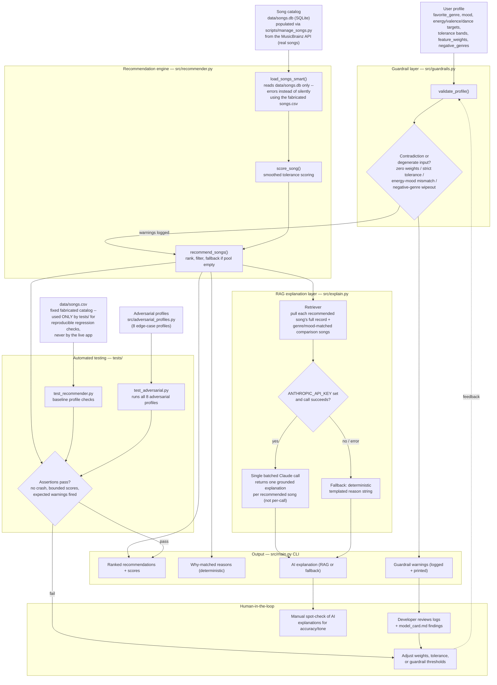

# System Diagram — Music Recommender Applied AI System

This diagram reflects the planned architecture: a rule-based recommendation engine wrapped by a
guardrail/validation layer, a RAG explanation layer, and an automated adversarial test suite that
checks the whole pipeline.

## Component key

| Component | Role |
|---|---|
| **Guardrail layer** (`guardrails.py`) | Validates a user profile *before* scoring — catches contradictions and degenerate inputs (zero weights, overly strict tolerance, energy/mood mismatches, genre filters that would empty the catalog) and logs warnings instead of crashing. |
| **Recommendation engine** (`recommender.py`) | Loads the catalog, scores each song against the profile with smoothed tolerance bands, ranks and filters, and falls back to an unfiltered pool if a hard filter would return nothing. |
| **RAG explanation layer** (`explain.py`) | Retrieves each recommended song's full attributes plus similar catalog songs, then makes ONE batched Claude call for the whole result set (not one call per song) asking it to generate short explanations grounded only in that retrieved data — never invents facts. Falls back to the deterministic reason string per song if no API key is set or the call fails/doesn't parse. |
| **Automated testing** (`tests/`) | `test_adversarial.py` runs all 8 adversarial profiles through the full pipeline on every `pytest` run, asserting the guardrails and scoring behave correctly under edge cases — this is the system checking itself, continuously. |
| **Human-in-the-loop** | A developer reads guardrail warnings and test failures (`model_card.md` documents this history), spot-checks AI-generated explanations for hallucination or tone issues, and tunes thresholds/weights based on what the automated layer surfaces. Humans supervise and adjust; they don't approve every individual recommendation. |

## Data flow summary

**Input** → user profile + song catalog (and, in testing, the 8 adversarial profiles) →
**Guardrail check** (warns on bad input, never blocks) → **Scoring/ranking** → **Retrieval** of
grounding data for the top results → **Generation** of a natural-language explanation (or
deterministic fallback) → **Output** to the CLI (recommendations, reasons, AI explanation,
warnings). In parallel, the **test suite** exercises this same pipeline against known-hard inputs
on every run, and its pass/fail result plus the logged warnings are what a **human** reviews to
decide whether to adjust the system.
